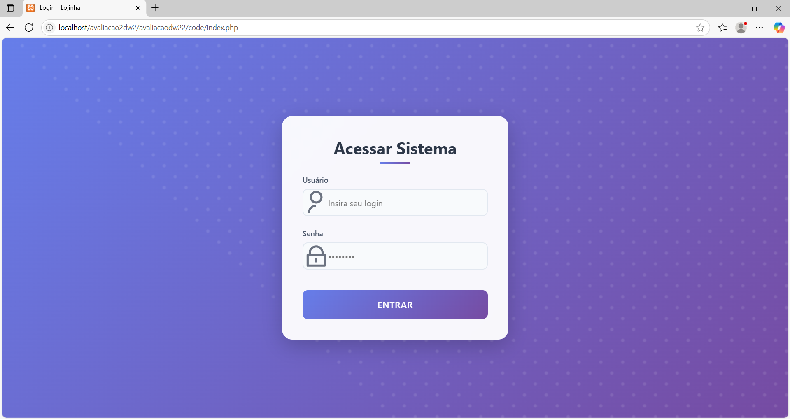
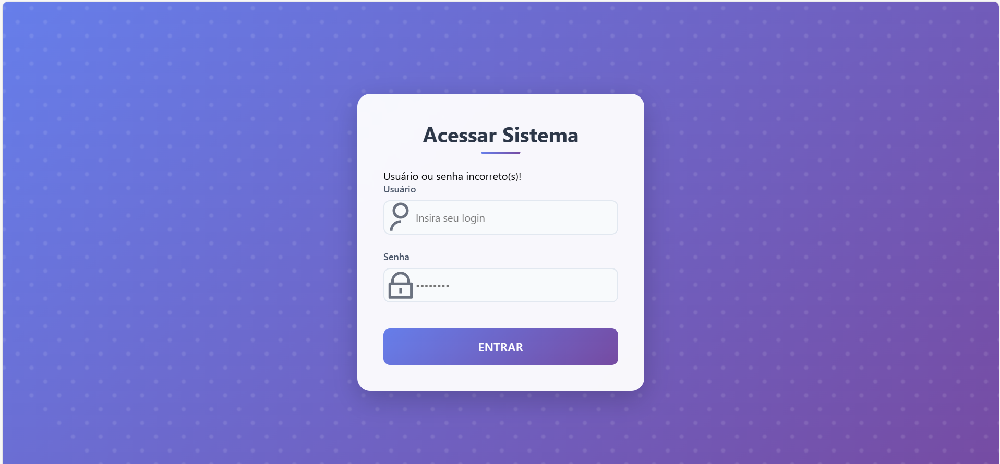
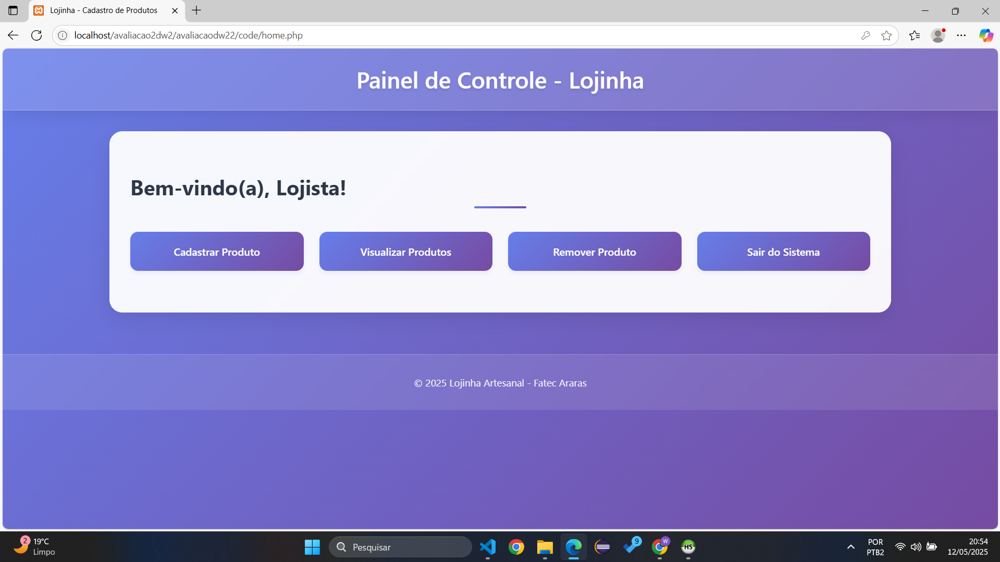
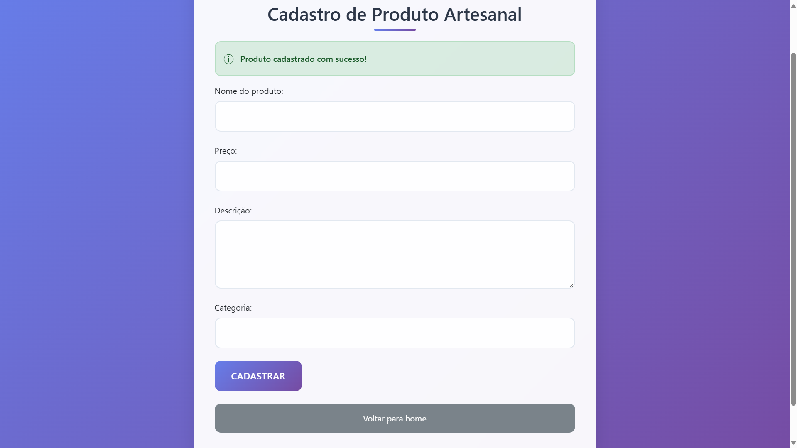
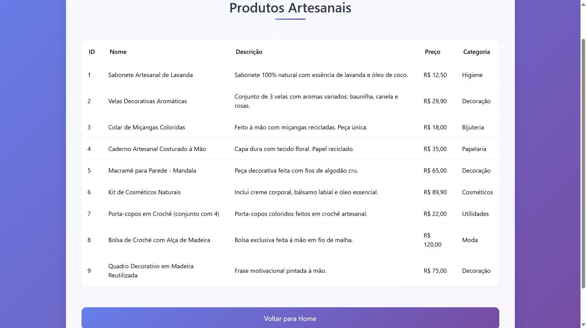

# FATEC_DES_WEB2_2025_Avaliacao2

---

## 📖 Descrição

**Catálogo Virtual de Produtos Artesanais** é um sistema web desenvolvido em PHP orientado a objetos, com acesso a banco de dados MySQL via PDO. Permite que um lojista gerencie seu catálogo — cadastrando, listando e removendo produtos — sempre após login seguro. Este repositório serve como avaliação da disciplina Desenvolvimento Web II (FATEC, 2º semestre/2025) e portfólio do(a) aluno(a).

---

## ⚙️ Funcionalidades

1. **Login/Logout**

   - Acesso protegido: apenas usuários autenticados podem gerir produtos.
   - Credenciais de teste:
     ```
     Usuário: admin
     Senha:  admin
     ```

2. **Cadastrar Produto**

   - Campos: Nome do Produto, Preço, Descrição, Categoria.
   - Validação mínima de preenchimento.

3. **Listar Todos os Produtos**

   - Visualização em tabela responsiva com Bootstrap 5.
   - Formatação de valores monetários.

4. **Remover Produto por ID**
   - Botão “Excluir” ao lado de cada linha.
   - Confirmação via JavaScript antes da remoção.

---

## 🗂️ Estrutura de Diretórios

```
avaliacao2/
├── code/
│ ├── classes/
│ │ ├── DB.php # Classe de conexão e operações no banco
│ │ └── login.php # Classe de autenticação
│ ├── home.php # Painel principal (botões de acesso)
│ ├── cadastro.php # Formulário de criação de produto
│ ├── listar.php # Listagem de produtos + remoção inline
│ └── remover.php # (Opcional) Remoção via ID em página separada
├── screenshots/ # Imagens de demonstração
│ ├── 1.png
│ ├── 2.png
│ ├── 3.png
│ ├── 4.png
│ ├── 5.png
│ └── 6.png
├── loja.sql # Dump do banco de dados MySQL
├── README.md # Este arquivo
└── .gitignore
```

---

## 📸 Screenshots

  
  
  
  
  


---

## 🛠️ Requisitos & Instalação

1. **Servidor local** (XAMPP, WAMP ou equivalente) com PHP ≥ 7.4 e MySQL.
2. Clone este repositório:
   ```bash
   git clone https://github.com/SEU_USUARIO/FATEC_DES_WEB2_2025_Avaliacao2.git
   ```

## 🔐 Segurança

- PDO com Prepared Statements: evita SQL Injection.

- Sessões PHP: controle de acesso restrito.

- Encapsulamento: toda a lógica de banco de dados fica dentro de DB.php, sem “SQL vazando” para outras páginas.

## 📝 Uso

- Faça login com “admin”/“admin”.

- Clique em Cadastrar Produto: preencha Nome, Preço, Descrição e Categoria.

- Clique em Visualizar Produtos: verifique a tabela.

- Para excluir um item, use o botão vermelho “Excluir” no final de cada linha.

## 📚 Documentação & Referências

- PHP: https://www.php.net/manual/pt_BR/

- PDO: https://www.php.net/manual/pt_BR/book.pdo.php

- Bootstrap 5: https://getbootstrap.com/docs/5.3/getting-started/introduction/

## 🤝 Contribuições

Contribuições são bem-vindas! Abra um issue para discutir melhorias ou envie um pull request com ajustes de código, estilização ou documentação.

<p align="center"> Desenvolvido por <strong>Wilson Júnior</strong> – FATEC SP, semestre 2-2025 </p>
