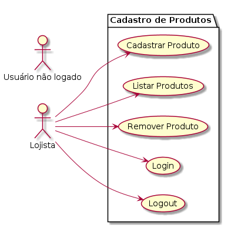

## Segunda Avaliação DESENVOLVIMENTO WEB II

## Como Realizar esta avaliação ?

1. Crie um repositório no seu github com o nome "<b>FATEC_DES_WEB2_2025 _Avaliacao2</b>"

2. Publicar no Teams <del>o arquivo zipado (.zip) do seu diretório avaliacao2 </del> o repositório que será avaliado pelo professor Orlando. Publicar sua prova no seu github como portifólio.

##  Desafio Técnico

Crie um sistema em PHP para que um lojista possa cadastrar, visualizar e remover produtos de sua lojinha.

Este sistema é utilizado em um catálogo virtual, onde o/a lojista pode manter seu catálogo de produtos atualizado. A gestão de produtos só é possível após login com sucesso.

Os campos que devem estar cadastrados são: 

 - Nome do Produto (varchar[100])

- Preço (decimal(10,2))

- Descrição (varchar[255])

- Categoria (varchar[30])
 

O arquivo com o dump do banco de dados está disponível no arquivo <b>loja.sql</b>
O seguinte diagrama de caso de uso ilustra as funcionalidades do sistema. 

Os casos de uso Login e Logout estão implementados de forma orientada a objetos. O modelo encontra-se no diretório code. Para estas funcionalidades, fez-se uso da classe Login (presente em login.php)

Para testes:
- Login: <b>admin</b>
- Senha: <b>admin</b>

### 1- Classe para cadastro (class DB) (30% da nota)
- Toda a manipulação de dados no banco de dados deve ocorrer dentro da classe DB. Esta classe está criada dentro do diretório <b>classes</b>.
- No método construtor, deve ser criado a conexão com o banco de dados MySQL 
- No método destrutor a conexão precisa ser fechada. 
- Os demais métodos, você deve criar com os nomes e argumentos que julgar apropriados.
- Esta classe deve encapsular a responsabilidade de cadastrar e remover produtos.
- Nenhum comando SQL deve "vazar" dessa classe.

### 2- Cadastrar Produtos (20% da nota)
- Cadastrar os campos informados anteriormente no banco de dados MySQL. <b>Será possível realizar o cadastro somente em uma sessão ativa</b>.

- Seu sistema terá um botão "Cadastrar produto" (arquivo home.php) que irá direcionar a uma página para o recebimento dos parâmetros.

- Os dados recebidos via input devem ser passado como parâmetros dos métodos da classe criada por você ( classe DB).

### 3- Remover Produto (20% da nota)
- Remover um produto pelo ID <b>Será possível remover somente em uma sessão ativa</b>.

- Seu sistema terá um botão "Remover Produto" (arquivo home.php) que irá direcionar a uma página para o recebimento do ID. Você pode optar por combobox, caixa de entrada (textbox) ou outra forma que achar conveniente.

- Os dados recebidos via input devem ser passado como parâmetros dos métodos da classe criada por você ( classe DB).

### 3- Listar todos os produtos (20% da nota)
- <b>Em uma área de sessão</b>, permitir ler todos os produtos cadastrados no banco de dados. Caso não esteja em uma sessão ativa, redirecionar para a área de login.

- Seu sistema terá um botão "Visualizar Produtos" ( arquivo home.php). Ao clicar, deve carregar uma página php, que irá acessar todos os produtos e apresentar ao usuário logado.

### 4- Informações sobre o projeto no README.md (10% da nota)
- Elabore um caprichado README.md que explique ao visitante em seu repositório público no github o que é o seu projeto.

## Considerações sobre o código

- PHP Orientado a objetos.
- Acesso ao MySQL: Faça uso do PDO encapsulado na classe DB.

## Critérios de avaliação

- Entregar todos os quesitos no prazo: 100% da nota.

- Entregar todos os quesitos com atraso: 70% da nota.

- Entregar todos os quesitos fora prazo: 0% da nota.

## Prazo final

Serão considerados <b>no prazo</b> os projetos publicados até o dia 12 de maio de 2025, 23h55.

Serão considerados <b>com atraso</b> os projetos publicados até o dia 15 de maio de 2025, 23hs55.

Serão considerados <b>fora do prazo </b> os projetos publicados posterior ao prazo estipulado anteriormente.

## Considerações Finais

Você pode consultar a documentação oficial, a documentação com o Zeal, os slides e códigos do repositório da nossa sala, e até mesmo conversar com colegas de sala. Poderá utilizar códigos gerados por LLM, desde que entenda os códigos.
 
<b>Mas</b> não é permitido copiar o código sem entender o que fez (popular cola). As atividades que forem cola serão zeradas.

 
O professor publicará informes no grupo de Whatsapp abaixo:

https://chat.whatsapp.com/LvGIymKOzQc5BaetmsGmSR

